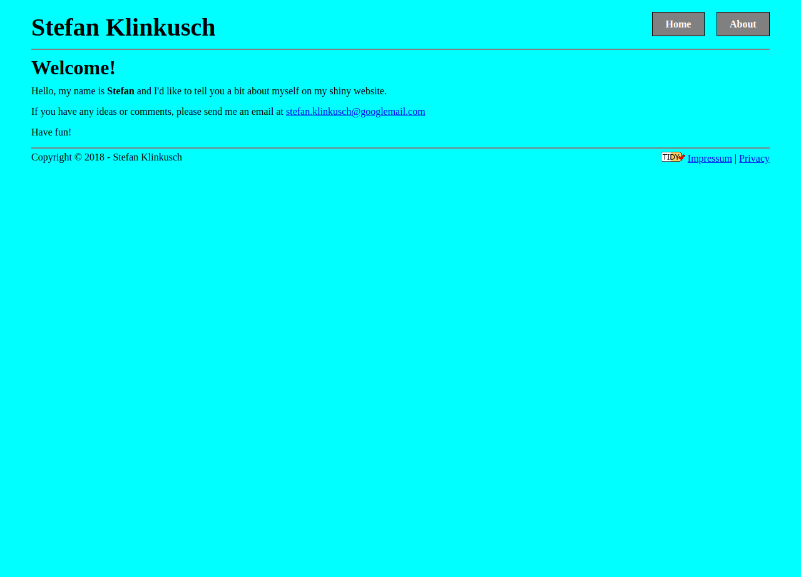

# CSS basics

This exercise was performed by Stefan Klinkusch at Digital Career Institute in Berlin, Germany using HTML and CSS.

## Features

It features
- a welcome page
  - semantic HTML elements (header, nav, main, footer, section, article, aside)
  - email address as a link
  - two additional links in the footer (impressum and privacy)
- an "About Me" page
  - insertation of an image file
  - lists
  
## Screenshot

## Original Task
### Description

This is an exercise for HTML &amp; CSS basics. You'll need to remember what the basic HTML structure looks like, how to use floats, image, links and lists.

### Tasks

1.  Create the following page layouts, that you see as mockups below. Feel free to be creative and add additional styling, but **only** after you finished the basic version.

### Mockups

